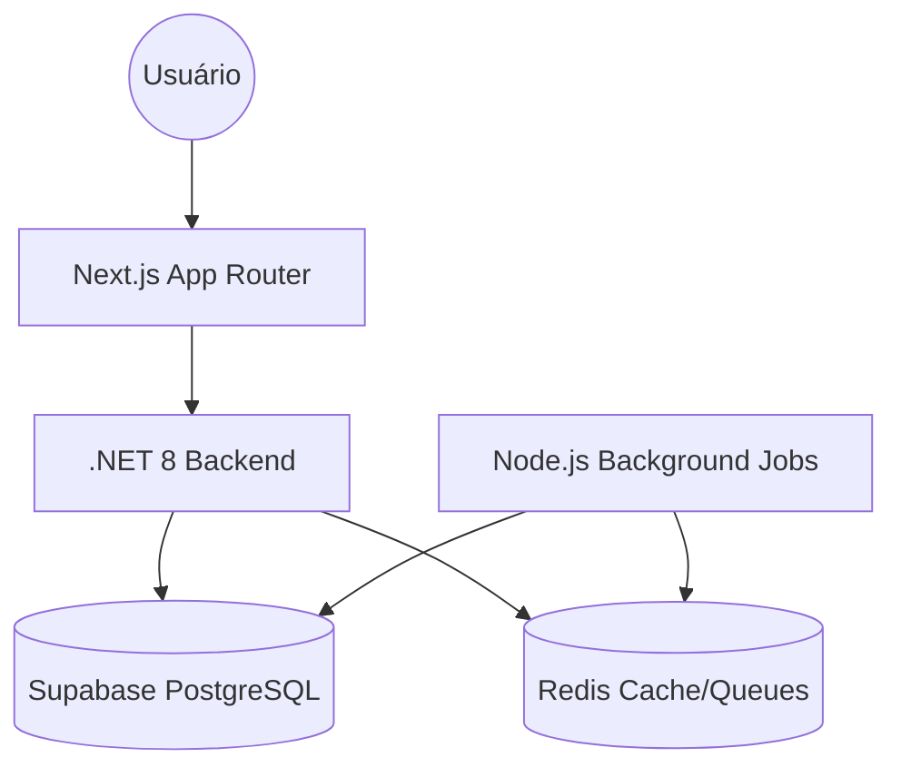

# Arquitetura JurisNexo

O JurisNexo utiliza uma arquitetura de monorepo para facilitar a gestão de múltiplos serviços e o compartilhamento de configurações.

## 🏗️ Visão Geral

## 📦 Componentes

- **apps/web**: Frontend Next.js 14 que serve a Landing Page, Dashboard e Auth.
- **apps/api**: Backend Principal em .NET 8 seguindo os princípios de Clean Architecture.
- **apps/worker**: Processamento em segundo plano (WhatsApp, Emails, Webhooks).
- **packages/**: Utilitários e configurações compartilhadas.
